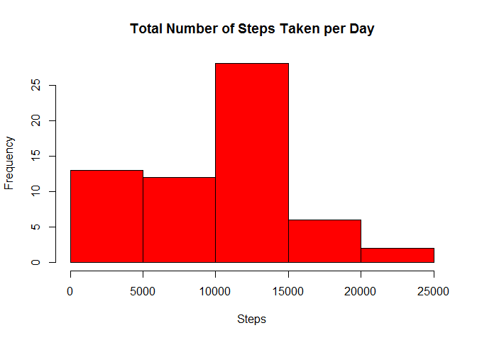
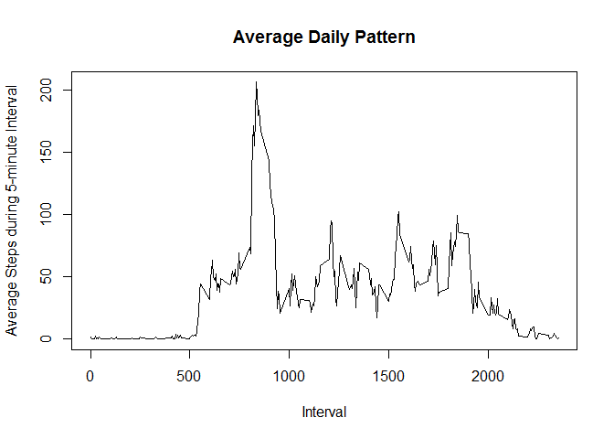
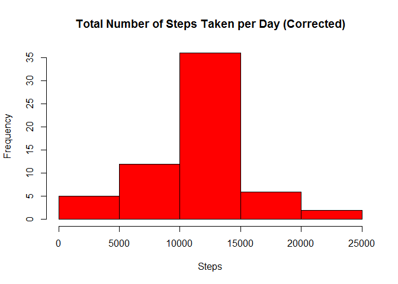

# Reproducible Research: Peer Assessment 1


This assignment makes use of data from a personal activity monitoring device. This device collects data at 5 minute intervals through out the day. The data consists of two months of data from an anonymous individual collected during the months of October and November, 2012 and include the number of steps taken in 5 minute intervals each day.

## Loading and preprocessing the data


```r
URL <- "https://d396qusza40orc.cloudfront.net/repdata%2Fdata%2Factivity.zip"
download.file(URL, "repdata_activity_data.zip")
unzip("repdata_activity_data.zip")
activity <- read.csv("activity.csv")
```

## What is mean total number of steps taken per day?


```r
stepsbydate <- tapply(activity$steps, activity$date, sum, na.rm = TRUE)
hist(stepsbydate, main = "Total Number of Steps Taken per Day", xlab = "Steps", col = "Red")
```

 

Here you can see a histogram showing the frequency of the total number of steps taken per day over the two-month observation period.


```r
mean(stepsbydate)
```

```
## [1] 9354.23
```

```r
median(stepsbydate)
```

```
## [1] 10395
```
The mean and median of the total number of steps taken per day is 9,354 and 10,395, respectively.

## What is the average daily activity pattern?


```r
stepsbyinterval <- tapply(activity$steps, activity$interval, mean, na.rm = TRUE)
plot(names(stepsbyinterval), stepsbyinterval, xlab = "Interval", ylab = "Average Steps during 5-minute Interval", main = "Average Daily Pattern", type = "l")
```

 

Here is a line plot showing the average daily activity pattern of the subject.


```r
c(max(stepsbyinterval), which.max(stepsbyinterval))
```

```
##               835 
## 206.1698 104.0000
```

The subject's most active 5-minute interval was at 835. The subject averaged just over 206 steps during that interval over the two-month period.

## Imputing missing values


```r
sum(is.na(activity))
```

```
## [1] 2304
```

```r
tapply(activity$steps, activity$date, function(elt) sum(is.na(elt)))
```

```
## 2012-10-01 2012-10-02 2012-10-03 2012-10-04 2012-10-05 2012-10-06 2012-10-07 2012-10-08 2012-10-09 
##        288          0          0          0          0          0          0        288          0 
## 2012-10-10 2012-10-11 2012-10-12 2012-10-13 2012-10-14 2012-10-15 2012-10-16 2012-10-17 2012-10-18 
##          0          0          0          0          0          0          0          0          0 
## 2012-10-19 2012-10-20 2012-10-21 2012-10-22 2012-10-23 2012-10-24 2012-10-25 2012-10-26 2012-10-27 
##          0          0          0          0          0          0          0          0          0 
## 2012-10-28 2012-10-29 2012-10-30 2012-10-31 2012-11-01 2012-11-02 2012-11-03 2012-11-04 2012-11-05 
##          0          0          0          0        288          0          0        288          0 
## 2012-11-06 2012-11-07 2012-11-08 2012-11-09 2012-11-10 2012-11-11 2012-11-12 2012-11-13 2012-11-14 
##          0          0          0        288        288          0          0          0        288 
## 2012-11-15 2012-11-16 2012-11-17 2012-11-18 2012-11-19 2012-11-20 2012-11-21 2012-11-22 2012-11-23 
##          0          0          0          0          0          0          0          0          0 
## 2012-11-24 2012-11-25 2012-11-26 2012-11-27 2012-11-28 2012-11-29 2012-11-30 
##          0          0          0          0          0          0        288
```

You can see all the missing values are contained in eight dates (Oct. 1,8 and Nov. 1,4,9,10,14,30)


```r
library(dplyr)
```

```
## 
## Attaching package: 'dplyr'
## 
## The following objects are masked from 'package:stats':
## 
##     filter, lag
## 
## The following objects are masked from 'package:base':
## 
##     intersect, setdiff, setequal, union
```

```r
intervals <- group_by(activity, interval)
intervals <- mutate(intervals, stepsadj = ifelse(is.na(steps) == 1, mean(steps, na.rm = TRUE), steps))
```

We will correct for this by filling missing value with the mean for that 5-minute interval over the two-month observation period. Filling in with the mean/median for that day will not work since the dates with missing data contain only missing data.


```r
stepsbydatefixed <- tapply(intervals$stepsadj, activity$date, sum, na.rm = TRUE)
hist(stepsbydatefixed, main = "Total Number of Steps Taken per Day (Corrected)", xlab = "Steps", col = "Red")
```

 

Because the dates with missing data contain only missing data and the missing data was ignored in the first part of the assignment, the step estimates in the first part of the assignment were 0. My way of correcting the data for missing values takes those eight days that were at 0 and moves them to the new mean of the data, resulting in a tighter distribution around the new mean, which is higher than the previous mean.

## Are there differences in activity patterns between weekdays and weekends?

